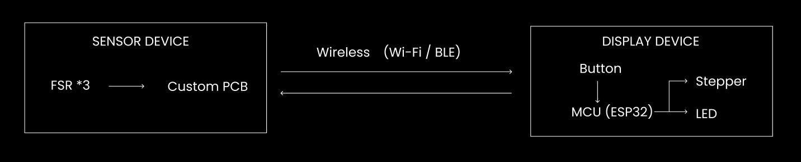

# ErgoCompass
## Product Idea
ErgoCompass is a product that tracks how you sit using pressure sensors in the back pad and wirelessly sends the data to a desk display. The display converts your posture into a simple status on a physical gauge needle, with an LED alerts when you’ve been slouching for too long. A button on the display device allows calibrating and resets the session.

## Sensor Device
 The sensor device is composed of a fabric back pad with pressure sensors embedded in it. The sensors detect the pressure distribution when a user sits against the pad. The data from the sensors is collected by a microcontroller, which processes the information to determine the user's posture. The device is powered by a rechargeable battery and includes wireless communication capabilities to send the posture data to the desk display.

 Componernts used in the sensor device include:
 - Pressure Sensors: 3 FSRs (Force Sensitive Resistor).
 - Microcontroller: Custom PCB, may include FSR resistor network, status LED.
 - Wireless Module: For transmitting data to the display device (BLE).
 - Battery: Rechargeable LiPo battery with battery indicator.

| Component name | Model | Quantity |
|----------------|-------|----------|
| Force sensitive resistor | Interlink FSR 406 | 3 |
| Main microcontroller  | Custom PCB | 1 |
| BLE wireless module | Raytac MDBT42Q-512KV2 (nRF52832)| 1 |
| External ADC (optional) | TI ADS1115IDGSR | 1 |
| LiPo battery | 1S LiPo | 1 |
| Status LED | LS R976 | 1 |

## Display Device
The display device receives the posture data from the sensor device and translates it into a visual representation using a physical gauge needle. The needle moves to indicate whether the user's posture is good, moderate, or poor based on the pressure data received. Additionally, the display includes 3 LEDs that displays different colours serving as a pressure level indicator to correct user's posture. A button on the display allows users to calibrate the system and reset their session data.

Components used in the display device include:
- 1 Microcontroller: ESP32.
- 1 Stepper motor driven gauge needle: To visually represent the user's posture.
- 3 LEDs: Indicate the pressure level at each sensor.
- 1 Button: For calibration and session reset functionality.
 - 1 Battery: Small rechargeable LiPo battery.

| Component name | Model | Quantity |
|----------------|-------|----------|
| Microcontroller | XIAO ESP32-C3 | 1 |
| Stepper motor| 28BYJ-48 | 1 |
| LEDs | NeoPixel | 3 |
| Button | Omron B3U-1000P | 1 |
| LiPo battery | 1S LiPo  | 1 |

## Diagrams
### Communication chart

### System Block Diagram
